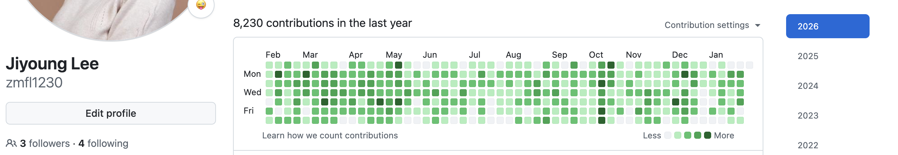

# 이지영 | Backend Engineer

📩 zmfl123097@gmail.com | 📦 https://github.com/zmfl1230 | 📦 https://github.com/socar-lua

---

## Profile Summary

월평균 약 200~250만 건의 거래가 발생하는 플랫폼에서
결제 시스템의 안정적인 운영과 거래 신뢰도 개선을 담당해온 백엔드 개발자입니다.

자체 페이 서비스 도입(쏘카페이), 결제 통합 플랫폼 구축,
신규 결제수단 추가(네이버페이 간편결제) 등
10개 이상의 결제 도메인 프로젝트를 주도하거나 기여해왔습니다.

결제 도메인에서 거래 데이터의 신뢰도와 정합성을 핵심 가치로 두고,
금융·결제 시스템 특성상 발생하는 거래 상태 불일치를 전제로
실시간 조회 → 이벤트 기반 비동기 재처리 → 배치 보정으로 이어지는
단계적 정합성 수렴 구조를 설계·구현하며 운영 안정성을 지속적으로 개선해왔습니다.

실시간 대사 시스템을 2.5년간 전담하여 **전체 코드의 84% 기여**했으며,
**최종 정합성 달성률 99.9%+** 수준을 달성하고,
일간 약 6~7만 건의 거래를 자동으로 대사·검증하여
이상 거래에 대해 자동 취소 및 모니터링이 가능한 대사 시스템을 구축했습니다.

배치 처리 최적화를 통해 **PG API 호출을 50~70% 감소**시키고
**배치 처리 시간을 30~50% 단축**했으며,
**월 600건 이상의 승인취소 실패 거래를 자동 재처리**하여
사용자 불편을 줄이고 CS 운영 비용 약 3% 절감에 기여했습니다.

최근에는 레거시 결제 시스템을 DB 모델링부터 재설계하며 재구축하여
코어 수정없이 신규 PG 연동이 가능하고 확장과 장애 대응이 용이한 결제 플랫폼 구조로 정비했습니다.

---

## Skills

- **Language:** Kotlin
- **Backend:** Spring Boot, JPA
- **Event / Async / Batch:** Kafka, Kafka Streams, AWS SQS, Spring Batch
- **Data Store:** MySQL, Redis
- **Infra / Observability:** AWS, Datadog, Grafana, Loki
- **Architecture:** Event-Driven, Idempotency, Modular Design, Batch-based Reconciliation
- **Development Productivity**
  - AI-assisted tooling for design review, refactoring support, test scenario generation, and documentation

---

## Experience

### 쏘카(SOCAR) | Backend Engineer
**결제개발팀 | 2022.04 ~ 재직 중 (3년 9개월)**

- 월 평균 약 200~250만 건 규모의 거래가 발생하는 결제 플랫폼의
  백엔드 설계·운영·구조 개선을 담당

- **[거래 일관성 시스템 구축 | 2023.09 ~ 2026.03, 2.5년, 단독]**
  **기여도: 전체 코드의 84% 기여**

  - 실시간 처리 시점의 거래 상태 불완전성과 외부 PG 장애를 전제로,
    Kafka·Spring Batch 기반의 실시간 조회 → 비동기 재처리 → 배치 보정 구조를 설계하여
    일평균 6-7만 건의 거래 상태가 장애·지연 상황에서도 최종적으로 정합한 상태로 수렴하는 거래 처리 구조 구축

  - Hash 기반 파티셔닝 및 Worker 레벨 캐싱으로 **PG API 호출 50~70% 감소**, **배치 처리 시간 30~50% 단축**

  - 기존 승인취소 실패 및 거래 불일치를 로그·모니터링 중심의 사후 대응에서 벗어나,
    Kafka Streams 기반 자동 복구 구조로 전환하여 **월 600건 이상 자동 재처리**,
    운영 부담 감소 및 CS 운영 비용 약 3% 절감

- **[결제 코어 플랫폼 재구축 | 2025.08 ~ 진행중, 백엔드 3명]**
  **기여도: 245 커밋, +159,674줄**

  - 부분취소 미지원, PG 장애 대응 불가 등 레거시 한계를 해소하기 위해
    결제 코어 인터페이스와 도메인 모델을 재정의하고
    **10개 PG를 통합**한 확장과 장애 대응이 용이한 결제 시스템을 재구축

  - 멀티 PG 검증 프로세스 자동화로 **검증 시간 83% 단축** (30~40분 → 5분)

- 자체 페이(쏘카페이), 외부 간편결제(네이버페이),
  모바일 바우처·쿠폰 등 신규 및 보조 결제수단 도입과 하위 서비스 연동 지원

---

## Additional

- **설계 문서화 & 기술 공유** → 설계 선택, 시행착오, 운영 중 주의사항을 정리해
  조직 내 공유 문서·발표 형태로 지속적으로 전파

  - 코루틴 환경에서 TraceId 전파 방식 및 로깅 설계 기준 정리
  - Kafka Streams 기반 승인취소 재처리 구조의 장애 대응 시나리오 및 모니터링 기준 공유

- **신규 기술 도입 사례 공유** → 신규 기술 도입 시 단순 적용이 아닌
  운영 안정성과 장애 대응을 고려한 내용을 함께 정리·공유

  - SQS 메시지 중복 처리 발생 원인 분석 및 방지 전략 정리
  - [네이버페이] Redis 분산락 도입 배경, 적용 기준 및 운영 결과 공유
  - AWS Secrets Manager 도입 과정에서의 시행착오와 운영 가이드 정리

- **운영 표준화 & 관측성 개선** → 사내 공통 로깅·모니터링 기준 수립 및 적용을 통해 장애 원인 분석 및 대응 속도 개선

- **설계 합의 중심의 협업 방식** → 설계 결정 시 개인 판단에 의존하기보다,
  문제 배경·대안·트레이드오프를 명확히 정리하고 팀 내 피드백과 운영 관점을 반영해 설계를 확정하는 개발 문화에 익숙함

- **Early Career Experience**
  - 학부 재학 중 교육 플랫폼 개발 프리랜서 경험 (Codewings, 2019.07 ~ 2020.11)
  - Django REST + React 기반 웹 서비스 구현 및 레거시 리팩토링

---

## Education

### 아주대학교 | 2016.03 - 2021.02 (4년 9개월)
- 경영학과(경영학부) 전공, ICT 융합(소프트웨어학부) 복수전공
- 2019 아주대학교 LINC+ 캡스톤 디자인 경진대회 - 최우수상
- 2018 아주대학교 융합 소프트웨어 및 아이디어 공모전 - 융합 SW 아이디어 분야 장려상

### 한국 인터넷 진흥원 | 2019.02 (2주)
- 한국인터넷진흥원 핀테크 서비스 개발 집중 과정 수료

---

## Additional Information

- **GitHub** (https://github.com/zmfl1230)
  - 업무 외 기술 학습 내용 정리 및 개발 관련 기록 관리

